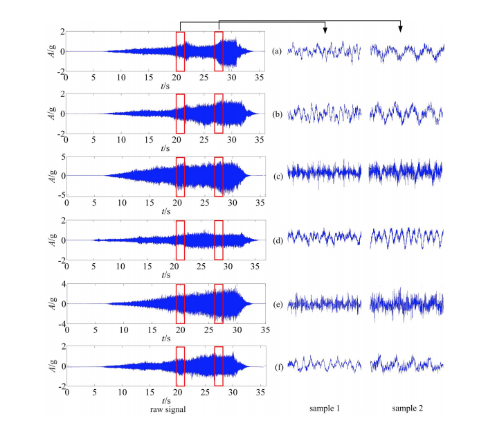

# Multi Scale 1D ResNet

This repository shows a super light-weighted classification network for time serial data with 1D convolution operations, comparing to [CSI-Net](https://github.com/geekfeiw/CSI-Net). The multi scale setting is inspired by Inception, and we find it useful.

## Tested Environment
1. python 3.6
1. pytorch 4.0.1
2. cuda 8.0/9.0
3. Windows7/Ubuntu 16.04

## Data
Our data are 6 categories of motor faults, shown as follows.

