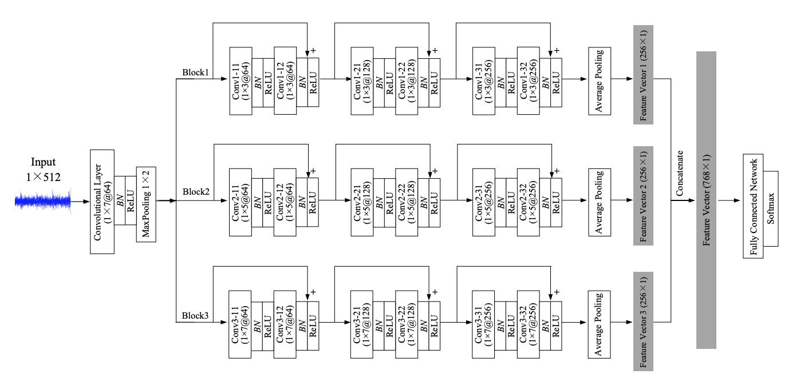

# Multi Scale 1D ResNet

This is a variation of our [CSI-Net](https://github.com/geekfeiw/CSI-Net), but it is a super light-weighted classification network for time serial data with 1D convolutional operation, where 1D kernels sweep along with the *time* axis. The multi scale setting is inspired by Inception, and we found it useful.

## Tested Environment
1. python 3.6
1. pytorch 0.4.1
2. cuda 8.0/9.0
3. Windows7/Ubuntu 16.04
